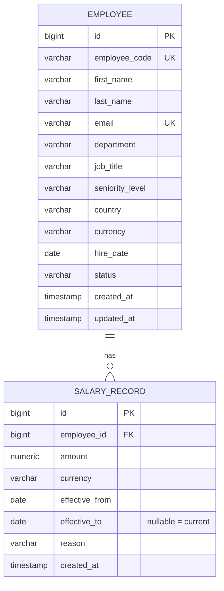

# Architecture & Design Notes

## Stack

| Layer    | Choice                                              | Why |
|----------|------------------------------------------------------|-----|
| Backend  | Java 21 (LTS) + Spring Boot 3.x, Maven (via `mvnw`)   | Matches the JD; Spring Data JPA + Flyway give a fast, well-trodden path to a typed data layer with versioned migrations. |
| Database | PostgreSQL 17                                        | Relational fit for normalized employee/salary data; already running locally. |
| Frontend | Angular (standalone components) + Angular Material   | Matches the JD; Material gives production-grade table/form/pagination components without hand-rolling them. |
| Seeding  | `net.datafaker` inside a Spring Boot `CommandLineRunner`, profile-gated | Keeps seeding in the same language/build as the backend; batch inserts to seed 10k rows in seconds. |

## Data model

**Why effective-dated salary records instead of a `salary` column on
`Employee`:** the HR Manager needs to answer "how has this person's pay
changed" and "what did we pay them on date X" — both impossible if a salary
change overwrites the only record. Each change inserts a new `SALARY_RECORD`
row and closes the previous open one (`effective_to = new.effective_from - 1
day`), keeping history append-only and queryable.

**Indexes**: `employee(department)`, `employee(country)`, `employee(status)`,
`salary_record(employee_id, effective_from)` — support both the filtered
employee list and the department/country aggregate analytics queries at
10k+ employees / 10k+ salary rows without full scans.

## API shape

REST, `/api/v1/...`, JSON. Pagination via `page`/`size`/`sort` query params on
list endpoints (Spring Data `Pageable`), matching Angular Material's paginator
model directly. See `backend/README` / Swagger UI (`/swagger-ui.html`) for the
live, authoritative contract once the backend is running.

## Currency handling

Salaries are stored and displayed in the employee's local currency. Analytics
endpoints group by department/country **and** currency rather than converting
to one reporting currency — see `docs/requirements.md` for the reasoning
(a fabricated FX rate would look precise but not be trustworthy for HR
decisions).

## Testing strategy

- **Backend**: service-layer unit tests (JUnit 5 + Mockito) for business logic
  (e.g. closing the previous salary record when a new one is added); web-slice
  tests (`@WebMvcTest` + MockMvc) for controllers/validation/error shape;
  repository tests against the real local Postgres instance (no Docker
  dependency assumed) using a dedicated `test` profile/schema.
- **Frontend**: Jasmine/Karma specs for the employee API service (via
  `HttpClientTestingModule`) and the employee list / analytics dashboard
  components — enough to cover the core interactions (search/filter, rendering
  fetched data) fast and deterministically, not exhaustive UI coverage.

## Trade-offs & things a follow-up iteration would address

- No authentication — acceptable for a single-persona take-home; would be the
  first addition before any real deployment (see `docs/requirements.md`).
- No approval workflow on salary changes — the effective-dated model doesn't
  preclude adding a `PENDING`/`APPROVED` status to `SALARY_RECORD` later
  without a schema rewrite.
- Analytics queries run directly against the transactional tables. At org
  sizes well beyond 10k this would move to a read replica or a
  precomputed/materialized view; at 10k rows with the indexes above it's not
  necessary yet.
