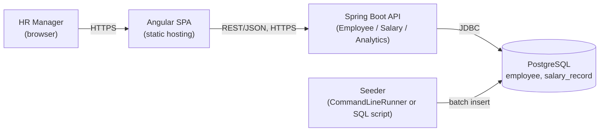
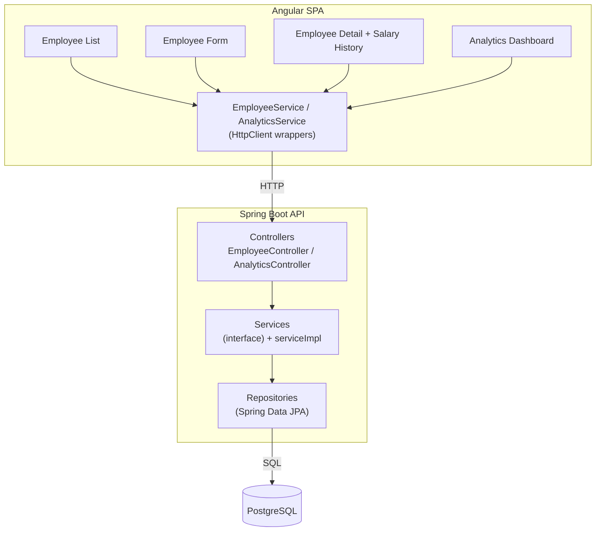
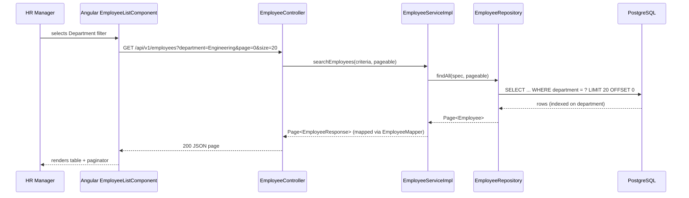
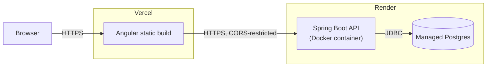
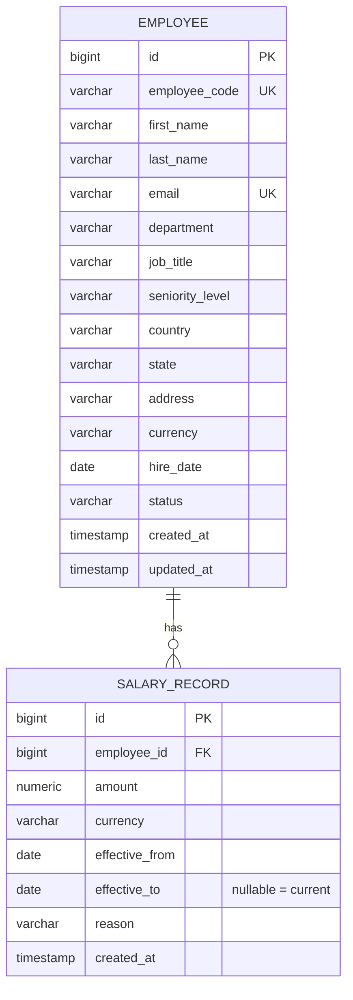

# Architecture & Design Notes

## Stack (as built)

| Layer    | Choice                                              | Why |
|----------|------------------------------------------------------|-----|
| Backend  | Java 21 (LTS) + Spring Boot 3.3.4, Maven (via `mvnw`) | Matches the JD; Spring Data JPA + Flyway give a fast, well-trodden path to a typed data layer with versioned migrations. |
| Database | PostgreSQL 17                                        | Relational fit for normalized employee/salary data; already running locally. |
| Frontend | Angular 21 (standalone components, `@if`/`@for`) + Angular Material | Matches the JD; Material gives production-grade table/form/pagination components without hand-rolling them. |
| Seeding  | `net.datafaker` inside a Spring Boot `CommandLineRunner` (`seed` profile), plus a standalone `backend/scripts/seed-employees.sql` for a pure-SQL alternative | Keeps seeding in the same language/build as the backend; batch inserts seed 10k rows in ~1-2 seconds either way. |

> The plan going in assumed a slightly different backend package layout and a
> single seeding path; both evolved during the build (see **Trade-offs**
> below and `docs/ai-usage.md`) and this document has been corrected to match
> what's actually in the repo, not the original plan.

---

## High-Level Design (HLD)

### System context



One HR-manager persona, one API, one database. No message queue, no cache
layer, no auth service — deliberately, because none of those are load-bearing
at the stated scale (10k employees, one internal user role). See
**Trade-offs** for what changes if that scope grows.

### Component view



### Request flow — "HR Manager searches employees by department"



### Deployment view (target, per `README.md`)



`README.md` also documents an AWS free-tier alternative (RDS + a single EC2
instance running the Docker image behind nginx) for cases where Render/Vercel
free tiers aren't an option.

---

## Low-Level Design (LLD)

### Backend package layout (as built, per explicit architectural direction)

```
com.incubyte.salarymanagement
├── controller/        EmployeeController, AnalyticsController
├── dto/
│   ├── request/       EmployeeCreateRequest, EmployeeUpdateRequest, SalaryRecordRequest
│   └── response/      EmployeeResponse, SalaryRecordResponse,
│                       DepartmentSalaryStat, CountrySalaryStat, SalaryBandStat,
│                       HeadcountSummary, PayrollByCurrency
├── model/              Employee, SalaryRecord   (JPA entities)
├── enums/              EmployeeStatus, SalaryChangeReason
├── repository/         EmployeeRepository, SalaryRecordRepository, AnalyticsRepository
│   └── projection/     native-query row projections for analytics
├── service/            EmployeeService, SalaryService, AnalyticsService (interfaces)
│   └── serviceImpl/    EmployeeServiceImpl, SalaryServiceImpl, AnalyticsServiceImpl
├── util/                EmployeeMapper, EmployeeCodeGenerator, EmployeeLookup
├── exception/           EmployeeNotFoundException, DuplicateEmployeeException,
│                        ApiError, GlobalExceptionHandler
├── config/              DataSourceConfig, CorsConfig, TomcatServerConfig
└── seed/                DataSeeder, CountryProfile, SeniorityProfile, SeedReferenceData
```

The controller/dto/model/enums/repository/service+serviceImpl/util/exception/
config split (and specifically service **interface** + a separate `serviceImpl`
package for implementations) was an explicit requirement, not a default
Spring Boot layout — every controller method also wraps its body in a
try/catch that logs via SLF4J before rethrowing, so `GlobalExceptionHandler`
still owns the actual HTTP error shape but nothing fails silently in the logs.

### Data model



**Why effective-dated salary records instead of a `salary` column on
`Employee`:** the HR Manager needs to answer "how has this person's pay
changed" and "what did we pay them on date X" — both impossible if a salary
change overwrites the only record. Each change inserts a new `SALARY_RECORD`
row and closes the previous open one (`effective_to = new.effective_from - 1
day`), keeping history append-only and queryable.

**Indexes**: `employee(department)`, `employee(country)`, `employee(status)`,
`salary_record(employee_id, effective_from)` — support both the filtered
employee list and the department/country aggregate analytics queries at
10k+ employees / 10k+ salary rows without full scans.

### API shape

REST, `/api/v1/...`, JSON. Pagination via `page`/`size`/`sort` query params on
list endpoints (Spring Data `Pageable`), matching Angular Material's paginator
model directly.

Key endpoints:

- `GET/POST /api/v1/employees`, `GET/PUT /api/v1/employees/{id}` — CRUD +
  search (`q`, `department`, `country`, `status`, pagination).
- `GET /api/v1/employees/departments`, `GET /api/v1/employees/countries` —
  **distinct values read straight from the database** (`SELECT DISTINCT ...
  ORDER BY ...`), specifically so the Employee List filters and the Add/Edit
  Employee form never hardcode a department or country list — whatever
  actually exists in the data is what shows up.
- `GET /api/v1/employees/{id}/salary-history`,
  `POST /api/v1/employees/{id}/salary-records` — append-only salary history.
- `GET /api/v1/analytics/by-department`, `/by-country`, `/salary-bands`,
  `/headcount-summary`, `/payroll-by-currency` — one grouped SQL query per
  endpoint (see **Performance considerations**).

See Swagger UI (`/swagger-ui.html`) for the live, authoritative contract once
the backend is running.

### Frontend design

- `core/services/` — each backend resource has an **abstract class acting as
  an interface** (`EmployeeService`, `AnalyticsService`) plus an `*Impl` class
  that does the actual `HttpClient` call, wired via
  `{ provide: EmployeeService, useClass: EmployeeServiceImpl }` in
  `app.config.ts`. This is a real dependency-injection seam (TypeScript
  interfaces can't be injection tokens, so components depend on the abstract
  class and never import the `Impl` directly) — components can be tested
  against a mock without touching `HttpClient`.
- `core/models/location-data.ts` wraps the `country-state-city` npm package
  (bundled, offline reference data — no external API calls) to drive the
  Country/State fields and derive each country's currency.
- `features/employees/employee-form/` — the Country field is a Material
  **autocomplete** (`MatAutocompleteModule` + a `FormControl<string |
  CountryOption>` + `toSignal(valueChanges.pipe(startWith(''), map(filter)))`)
  rather than a flat `mat-select`, so typing filters ~250 countries instead of
  scrolling them. Department options come from
  `EmployeeService.getDistinctDepartments()` — the same database-driven list
  used by the Employee List filters, not a static array.
- `features/analytics/analytics-dashboard/` — the currency picker is derived
  from the analytics response itself (`departmentStats().map(row =>
  row.currency)`), not a hardcoded currency list, so it only ever shows
  currencies that actually exist in the seeded data.

---

## How to run this as a system-design round

If this project comes up as the basis for a live system-design discussion
(as opposed to "walk me through your code"), the evaluator is checking
*process* — how you scope, estimate, and reason under constraints — more than
whether you recall exact class names. A structure that works for almost any
system-design prompt, applied to this one:

### 1. Clarify requirements and scale (2–3 min)

Restate the problem in your own words before designing anything:
*"An HR Manager needs to manage salary data for ~10,000 employees across
multiple countries: CRUD, an auditable history of pay changes, search at
that scale, and some aggregate analytics. Single internal user role, no
public-facing traffic."*

Ask (or state your assumption if no one's there to ask):
- Read vs write ratio? → Assume read-heavy (HR browsing/searching far more
  often than editing) — this justifies indexes over write-optimization.
- Growth — 10k a ceiling, or heading to 100k+ / multi-tenant? → Assume 10k
  is the near-term ceiling for this exercise, but design so the obvious next
  step (pagination, indexes, precomputed analytics) doesn't require a
  rewrite.
- Consistency needs? → Strong consistency is fine; one Postgres instance,
  no distributed-transaction problem at this scale.

### 2. Back-of-envelope numbers (1–2 min)

- 10,000 employees × ~1 salary record/year → ~10-15k salary rows/year. Tiny
  by database standards — this is not a "shard the database" problem.
- A employee-list query with 3 filter columns + pagination on 10k rows, each
  indexed, returns in single-digit milliseconds — say this out loud so the
  interviewer sees you're not over-engineering for a scale that doesn't
  exist yet.
- Say explicitly where the numbers *would* change the design: "if this were
  10 million employees instead of 10,000, I'd reach for a read replica for
  analytics and a materialized view refreshed on a schedule instead of
  querying the transactional tables live — but at 10k rows with the right
  indexes, that's premature."

### 3. High-level design (5 min)

Draw (or describe) the **System context** and **Component view** diagrams
above: browser → SPA → REST API → single Postgres instance. Name the three
API surfaces (Employee CRUD, Salary history, Analytics) and why they're
separate services/controllers rather than one god-service — single
responsibility, and each has a different failure/testing profile.

### 4. Deep-dive on the interesting part (10+ min — this is where you're
   actually evaluated)

Pick **one** decision and defend it end-to-end, because that's what
distinguishes "I can draw boxes" from "I understand trade-offs":

- **Effective-dated salary records vs. a mutable `salary` column.** Walk
  through why overwriting loses auditability, how a new record closes the
  previous one, and how this makes "what did we pay them on date X" a single
  indexed range query (`effective_from <= X AND (effective_to IS NULL OR
  effective_to >= X)`) instead of needing a separate audit-log table.
- **Why analytics run as raw grouped SQL instead of pulling rows into Java.**
  A `GROUP BY department` with `AVG(amount)` lets Postgres do the reduction
  once; pulling 10k rows into the JVM to average them client-side is strictly
  worse at every scale and only gets worse as rows grow.
- **Why department/country filter options come from `SELECT DISTINCT`
  against the live table instead of a static enum/config list.** A static
  list drifts from reality the moment someone adds a new country or
  department; querying the actual data means the filter dropdown can never
  show a country with zero employees or hide one that exists.
- **Seeding 10k rows in ~1-2 seconds.** Pre-allocate all IDs in one round
  trip (`generate_series` + `nextval`), then one `JdbcTemplate.batchUpdate`
  with `reWriteBatchedInserts=true`, bypassing the JPA persistence context
  entirely — explain *why* persisting 10k managed entities one at a time
  would be slow (dirty-checking overhead, one round trip per row without
  batching) even though it's the "normal" Spring Data path.

### 5. Trade-offs and what you'd change at 10x/100x scale (2–3 min)

Have a ready answer, not an improvised one — this is exactly the "Trade-offs"
section below, said out loud:

- No auth today (single persona, take-home scope) → first thing added before
  any real deployment; note it doesn't require a data-model change, just a
  `principal`/role check in front of existing endpoints.
- Analytics query the transactional tables directly → fine at 10k rows; at
  meaningfully larger scale, move to a read replica or a materialized view
  refreshed on a schedule, because analytical (wide scan) and transactional
  (narrow, frequent) query patterns start to compete for the same buffer
  cache and lock resources.
- CORS defaults to `*` for frictionless free-tier deploys → in a real
  deployment this becomes the single known frontend origin, read from an env
  var so it's a config change, not a code change.
- Single Postgres instance, no cache layer → correct call at this scale; if
  the employee list became a very-high-traffic read path, a cache in front of
  the distinct-departments/countries endpoints (which change rarely) would be
  the first thing added — not a general-purpose cache-everything layer.

### What to avoid saying

- Don't reach for Kafka/Redis/microservices/sharding to justify architectural
  sophistication — at 10k rows and one user role, that's a sign of not
  reading the requirements, not a sign of seniority. Naming the scale at
  which you *would* reach for them (as in step 5) demonstrates the same
  judgment without the over-engineering.
- Don't present the effective-dated salary model as "the obvious choice" —
  say what it costs (an extra join/range query instead of a flat column read)
  and why that cost is worth paying for auditability. Trade-offs presented
  without a cost are not trade-offs.

---

## Testing strategy

- **Backend**: service-layer unit tests (JUnit 5 + Mockito) for business logic
  (e.g. closing the previous salary record when a new one is added,
  distinct-department/country delegation); repository tests
  (`@DataJpaTest`) against a dedicated `test` Postgres profile — including a
  test asserting `findDistinctDepartments`/`findDistinctCountries` return
  sorted, de-duplicated values; controller-level coverage via the service
  layer's contract.
- **Frontend**: specs run on Angular's default test runner (Vitest via
  `@angular/build:unit-test` in Angular 21, not Karma/Jasmine) for the
  employee API service (via `provideHttpClientTesting`) and the employee
  list / employee form / analytics dashboard components — including a
  regression test asserting the Save button's enabled state doesn't
  regress when hidden create-only fields (hire date, starting salary) are
  present in the form but not visible in edit mode.

## Performance considerations

- **Seeding**: 10,000 employees + related salary records seed in roughly 1-2
  seconds by bypassing JPA entirely for the bulk insert — pre-allocating IDs
  in one round trip (`SELECT nextval(...) FROM generate_series(...)`) and
  using `JdbcTemplate.batchUpdate` with `reWriteBatchedInserts=true` on the
  JDBC URL, rather than persisting 10k+ managed entities one at a time. A
  standalone `backend/scripts/seed-employees.sql` provides the same outcome
  as pure SQL for environments where running the Spring Boot seeder isn't
  convenient.
- **List/search at scale**: the employee list never loads more than one page
  (`Pageable`) from Postgres, and the combined department/country/status/
  free-text search query is covered by the indexes in the migrations so it
  doesn't fall back to a sequential scan of all 10k+ rows per keystroke.
- **Analytics**: the department/country/band aggregates and the
  headcount/payroll summary are each a single grouped SQL query (one using a
  `NTILE` window function for quintile bands, one using `FILTER` clauses for
  the headcount summary) rather than pulling rows into the application and
  aggregating in Java — the database does the reduction once per request.
- **Frontend bundle**: the employee create/edit route is lazy-loaded
  separately from the rest of the app specifically because it's the only
  route that needs `country-state-city`'s bundled country/state dataset,
  keeping that weight off the initial page load (list/detail/analytics).

## Environment note

Local development hit a JDK 23 / Windows-specific issue: the default Tomcat
NIO connector's `Selector.open()` failed (`Unable to establish loopback
connection`) because the JVM's Unix-domain-socket-based pipe used for
selector wakeup doesn't work in this environment. `TomcatServerConfig` switches
the connector to `Http11Nio2Protocol` (Windows IOCP-backed, no `Selector`
involved), which sidesteps it without touching any OS/network configuration.
Harmless on Linux/macOS deployments — NIO2 is a normal, supported Tomcat
connector everywhere.

## Trade-offs & things a follow-up iteration would address

- No authentication — acceptable for a single-persona take-home; would be the
  first addition before any real deployment (see `docs/requirements.md`).
- No approval workflow on salary changes — the effective-dated model doesn't
  preclude adding a `PENDING`/`APPROVED` status to `SALARY_RECORD` later
  without a schema rewrite.
- Analytics queries run directly against the transactional tables. At org
  sizes well beyond 10k this would move to a read replica or a
  precomputed/materialized view; at 10k rows with the indexes above it's not
  necessary yet.
- CORS defaults to allowing any origin (`APP_CORS_ALLOWED_ORIGINS=*`) so the
  free-tier backend and frontend deploys don't have to happen in a specific
  order (see `README.md`'s deploy section). A real deployment would set this
  to the exact known frontend origin instead — the app reads it from an env
  var specifically so that's a config change, not a code change.
