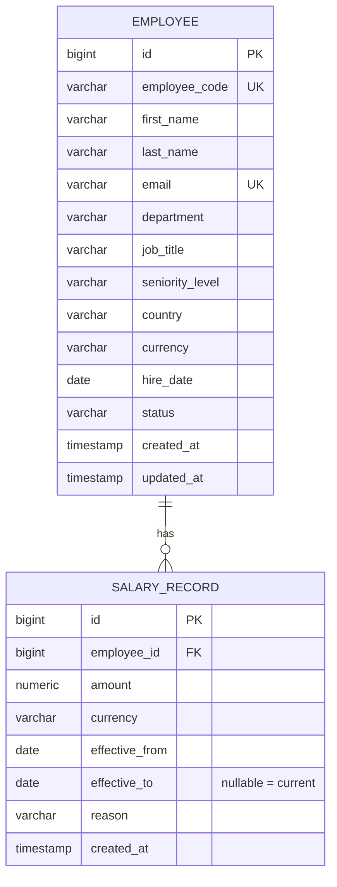

# Architecture & Design Notes

## Stack

| Layer    | Choice                                              | Why |
|----------|------------------------------------------------------|-----|
| Backend  | Java 21 (LTS) + Spring Boot 3.x, Maven (via `mvnw`)   | Matches the JD; Spring Data JPA + Flyway give a fast, well-trodden path to a typed data layer with versioned migrations. |
| Database | PostgreSQL 17                                        | Relational fit for normalized employee/salary data; already running locally. |
| Frontend | Angular (standalone components) + Angular Material   | Matches the JD; Material gives production-grade table/form/pagination components without hand-rolling them. |
| Seeding  | `net.datafaker` inside a Spring Boot `CommandLineRunner`, profile-gated | Keeps seeding in the same language/build as the backend; batch inserts to seed 10k rows in seconds. |

## Data model

**Why effective-dated salary records instead of a `salary` column on
`Employee`:** the HR Manager needs to answer "how has this person's pay
changed" and "what did we pay them on date X" — both impossible if a salary
change overwrites the only record. Each change inserts a new `SALARY_RECORD`
row and closes the previous open one (`effective_to = new.effective_from - 1
day`), keeping history append-only and queryable.

**Indexes**: `employee(department)`, `employee(country)`, `employee(status)`,
`salary_record(employee_id, effective_from)` — support both the filtered
employee list and the department/country aggregate analytics queries at
10k+ employees / 10k+ salary rows without full scans.

## API shape

REST, `/api/v1/...`, JSON. Pagination via `page`/`size`/`sort` query params on
list endpoints (Spring Data `Pageable`), matching Angular Material's paginator
model directly. See `backend/README` / Swagger UI (`/swagger-ui.html`) for the
live, authoritative contract once the backend is running.

## Currency handling

Salaries are stored and displayed in the employee's local currency. Analytics
endpoints group by department/country **and** currency rather than converting
to one reporting currency — see `docs/requirements.md` for the reasoning
(a fabricated FX rate would look precise but not be trustworthy for HR
decisions).

## Testing strategy

- **Backend**: service-layer unit tests (JUnit 5 + Mockito) for business logic
  (e.g. closing the previous salary record when a new one is added); web-slice
  tests (`@WebMvcTest` + MockMvc) for controllers/validation/error shape;
  repository tests against the real local Postgres instance (no Docker
  dependency assumed) using a dedicated `test` profile/schema.
- **Frontend**: specs run on Angular's default test runner (Vitest via
  `@angular/build:unit-test` in Angular 21, not Karma/Jasmine) for the employee
  API service (via `provideHttpClientTesting`) and the employee list / employee
  form / analytics dashboard components — enough to cover the core
  interactions (search/filter, rendering fetched data, error handling on
  create/update) fast and deterministically, not exhaustive UI coverage.

## Performance considerations

- **Seeding**: 10,000 employees + ~12,000 salary records seed in under 2
  seconds by bypassing JPA entirely for the bulk insert — pre-allocating IDs in
  one round trip (`SELECT nextval(...) FROM generate_series(...)`) and using
  `JdbcTemplate.batchUpdate` with `reWriteBatchedInserts=true` on the JDBC URL,
  rather than persisting 10k+ managed entities one at a time.
- **List/search at scale**: the employee list never loads more than one page
  (`Pageable`) from Postgres, and the combined department/country/status/
  free-text search query is covered by the indexes in the migrations
  (`employee(department)`, `employee(country)`, `employee(status)`) so it
  doesn't fall back to a sequential scan of all 10k+ rows per keystroke.
- **Analytics**: the department/country/band aggregates and the
  headcount/payroll summary are each a single grouped SQL query (one using a
  `NTILE` window function for quintile bands, one using `FILTER` clauses for
  the headcount summary) rather than pulling rows into the application and
  aggregating in Java — the database does the reduction once per request.
- **Frontend bundle**: the employee create/edit route is lazy-loaded
  separately from the rest of the app specifically because it's the only
  route that needs `country-state-city`'s bundled country/state dataset,
  keeping that weight off the initial page load (list/detail/analytics).

## Environment note

Local development hit a JDK 23 / Windows-specific issue: the default Tomcat
NIO connector's `Selector.open()` failed (`Unable to establish loopback
connection`) because the JVM's Unix-domain-socket-based pipe used for
selector wakeup doesn't work in this environment. `TomcatServerConfig` switches
the connector to `Http11Nio2Protocol` (Windows IOCP-backed, no `Selector`
involved), which sidesteps it without touching any OS/network configuration.
Harmless on Linux/macOS deployments — NIO2 is a normal, supported Tomcat
connector everywhere.

## Trade-offs & things a follow-up iteration would address

- No authentication — acceptable for a single-persona take-home; would be the
  first addition before any real deployment (see `docs/requirements.md`).
- No approval workflow on salary changes — the effective-dated model doesn't
  preclude adding a `PENDING`/`APPROVED` status to `SALARY_RECORD` later
  without a schema rewrite.
- Analytics queries run directly against the transactional tables. At org
  sizes well beyond 10k this would move to a read replica or a
  precomputed/materialized view; at 10k rows with the indexes above it's not
  necessary yet.
- CORS defaults to allowing any origin (`APP_CORS_ALLOWED_ORIGINS=*`) so the
  free-tier backend and frontend deploys don't have to happen in a specific
  order (see `README.md`'s deploy section). A real deployment would set this
  to the exact known frontend origin instead — the app reads it from an env
  var specifically so that's a config change, not a code change.
